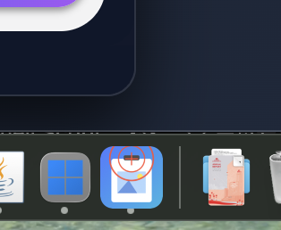

# SnippingEdit for macOS

A screenshot and annotation tool for macOS with instant selection memory and drawing capabilities. Inspired by Windows Snipping Tool for ease of editing clipboard images during AI-assisted work.


## App Icon



*The SnippingEdit icon as it appears in your macOS dock*

> **Note:** This is an AI-assisted project. The creator has no prior experience in Swift.

## Requirements

- macOS 14.0 or later
- Swift 5.9 or later

## Building the Application

### Debug Build

Build and run for development/testing:

```bash
# Quick build and run with icon support
./run.sh
```

Or manually:

```bash
# Build debug version
swift build

# Run as app bundle (recommended - shows proper icon)
open build/SnippingEdit.app

# Or run executable directly (no icon displayed)
./.build/debug/SnippingEdit
```

### Release Build

Build optimized .app bundle for distribution:

```bash
# Build release .app bundle
./build_app.sh

# Run the app
open build/SnippingEdit.app
```

The release build creates:
- `build/SnippingEdit.app` - The application bundle
- `build/SnippingEdit-Distribution.zip` - Distribution package with fix scripts

## Features

- **Clipboard monitoring** - Automatically detects clipboard image updates and captures them for editing
- **Animated dock icon** - Provides visual feedback with a 2-second pulsing animation when clipboard images are detected
- **Annotation tools** - 8-color palette for drawing on captured images
- **Easy clipboard saving** - One-click save edited images back to clipboard for seamless AI workflow integration
- **Keyboard shortcuts** - Enter to confirm, Escape to cancel, Delete to undo
- **Screenshot capture** - Quickly capture and edit any part of your screen

## Troubleshooting

### "App is damaged" error (downloaded builds)
```bash
# Remove quarantine attribute
xattr -cr build/SnippingEdit.app
chmod +x build/SnippingEdit.app/Contents/MacOS/SnippingEdit
```

Or use the included fix script:
```bash
./fix_downloaded_app.sh build/SnippingEdit.app
```

## License

This project is provided as-is for educational and personal use.

