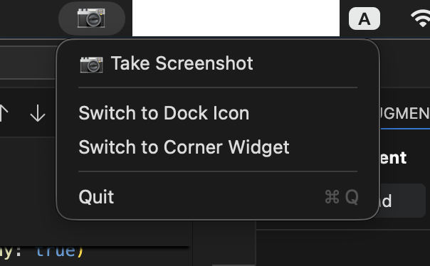
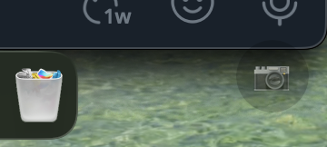
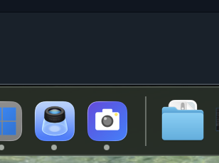
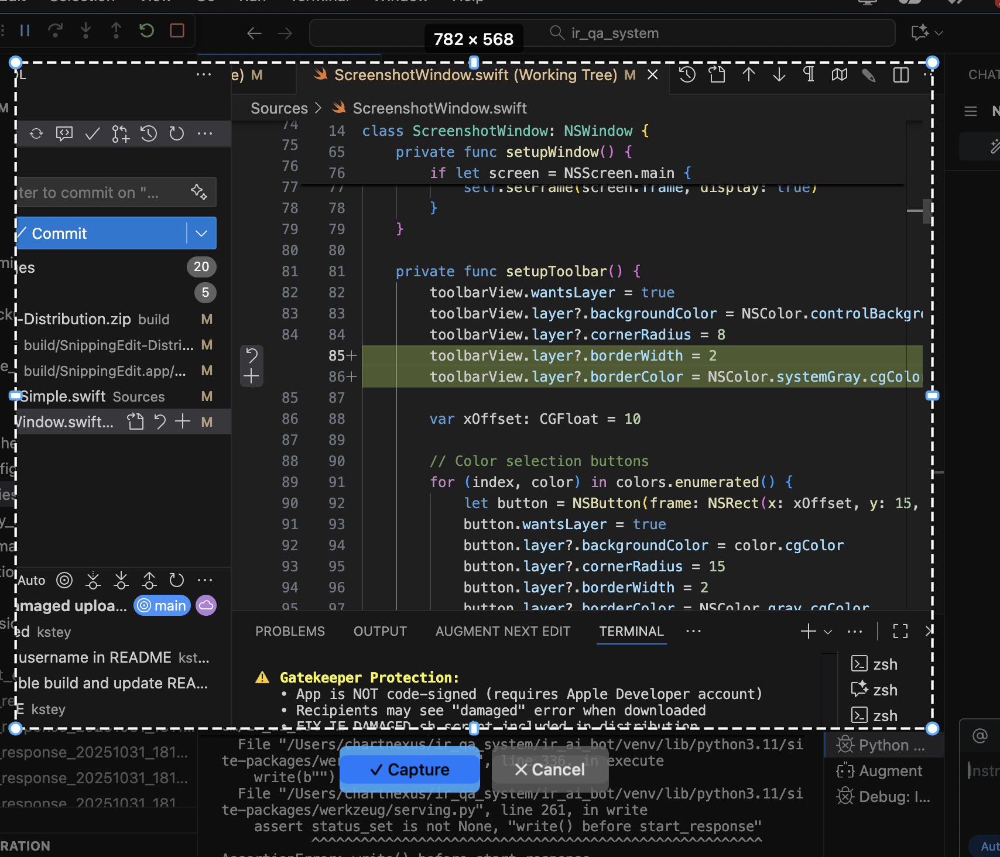
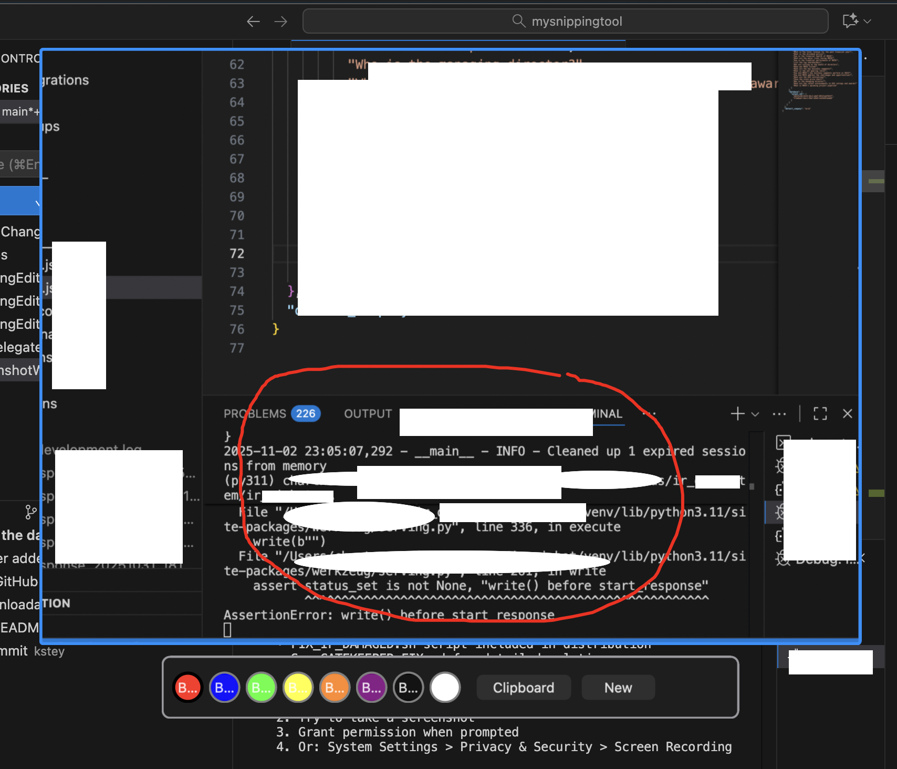

# SnippingEdit for macOS

Inspired by SnippingTool in Windows, which i missed when using Mac OS; I decided to use AI to write this simple tool - A Screenshot and annotation tool, for macOS, with advanced selection features, instant capture, and intuitive UI. Perfect for creating tutorials, documentation, and quick screen captures. 

## A note from the author

I originally built SnippingEdit for my own convenience while working with AI tools—quickly capturing, annotating, and sharing visuals during iterative workflows.

**Important:** This is an AI-assisted project created without personal experience in Swift development. The app was built and tested on an M3 Max Mac. Due to my limited Swift expertise, I may not be able to provide clear answers or solutions to issues that arise from different macOS setups, configurations, or hardware.

This is a free, personal project shared as‑is. Use it at your own discretion. I don't provide warranties or support and am not responsible for any loss, damage, or issues arising from its use.


---

## 📥 Download

**Ready to use!** Download the pre-built distribution ZIP:

👉 **[Download SnippingEdit-Distribution.zip](../../raw/main/build/SnippingEdit-Distribution.zip)** 

After downloading, unzip and open `SnippingEdit.app` inside the extracted folder. If macOS blocks the app, see the Troubleshooting and Installation sections below for the included fix script.

Or clone the repository and use the app directly:
```bash
git clone https://github.com/kstey/SnippingEdit.git
cd SnippingEdit
open build/SnippingEdit.app
```

**Note:** On first launch, macOS may show a security warning. Go to **System Settings > Privacy & Security** and click "Open Anyway".

---

## 📑 Table of Contents

- [Key Features](#-key-features)
- [What Makes SnippingEdit Special](#-what-makes-snippingedit-special)
- [Requirements](#requirements)
- [Building and Running](#building-and-running-the-app)
- [Installation](#installation)
- [Quick Start Guide](#-quick-start-guide)
- [Detailed Usage](#-detailed-usage)
- [Permissions](#permissions)
- [Tips & Tricks](#-tips--tricks)
- [App Architecture](#-app-architecture)
- [Troubleshooting](#-troubleshooting)
- [Future Enhancements](#-future-enhancements-roadmap)
- [Contributing](#-contributing)
- [Changelog](#-changelog)

---

## ✨ Key Features

### 📸 Smart Screenshot Capture
- **Full-screen capture** with instant overlay
- **Screen Recording permission** integration
- **Multiple launch modes**: Menu bar, floating window, or dock icon

### 🚀 Instant Selection (NEW!)
- **Selection appears immediately** when you trigger a screenshot
- **Remembers your last selection** - perfect for repetitive captures of the same area
- **Full screen default** on first use (with 100px padding)
- **40% faster workflow** for repetitive screenshots
- No need to manually draw selection every time!

### 🎯 Advanced Selection Tools
- **Dashed border** with shadow for better visibility
- **Real-time dimension display** showing exact pixel size (e.g., "1920 × 1080")
- **8 resize handles**:
  - 4 corner handles (circular, blue) - resize diagonally
  - 4 edge handles (rectangular, blue) - resize in one direction
- **Movable selection** - click inside and drag to reposition
- **Create new selection** - click outside existing selection and drag
- **Smart cursor feedback** - changes based on hover position
- **Minimum size enforcement** - prevents tiny selections

### 🎨 Professional UI
- **"✓ Capture" button** (blue, 120×40px) - confirms selection
- **"✕ Cancel" button** (gray, 100×40px) - cancels operation
- **Smart button positioning** - appears below selection (or above if no space)
- **Real-time button updates** - follows selection as you resize/move
- **Keyboard shortcuts still work** - Enter to capture, Escape to cancel

### 🖌️ Drawing & Annotation Tools
- **Pencil tool** with smooth drawing
- **8 color palette**: Red, Blue, Green, Yellow, Orange, Purple, Black, White
- **Undo support** - Delete key removes last drawn line
- **Clear all** - Cmd+R clears all drawings
- **Draw on cropped area** only

### 📋 Clipboard Integration
- **One-click copy** to clipboard
- **Includes annotations** - final image with all drawings
- **Paste anywhere** - works with all macOS apps

### ⌨️ Keyboard Shortcuts
| Shortcut | Action |
|----------|--------|
| `Enter` | Confirm selection / Capture |
| `Escape` | Cancel / Close |
| `Delete` | Remove last drawn line |
| `Cmd+R` | Clear all drawings |

### 🎛️ Flexible Launch Modes
Choose how you want to access the app:

<table>
<tr>
<td align="center"><b>Menu Bar Mode</b><br/>Minimal, always accessible from menu bar<br/></td>
<td align="center"><b>Corner Widget Mode</b><br/>Small floating button on screen<br/></td>
<td align="center"><b>Dock Icon Mode</b><br/>Traditional app with dock icon<br/></td>
</tr>
</table>

## 🎯 What Makes SnippingEdit Special

### Instant Capture Workflow
**Traditional tools**: Click → Wait → Draw selection → Resize → Capture
**SnippingEdit**: Click → Selection ready → Capture (or adjust)

### Smart Selection Memory
- Captures the same area repeatedly? Selection remembers your position!
- Perfect for monitoring, tutorials, or documentation
- Normalized coordinates work across different screen resolutions

### Professional Polish
- Dashed borders don't obscure content
- Real-time dimensions for precise captures
- Large, clickable buttons for easy confirmation
- Smooth, responsive resize handles
- Matches modern screenshot tools (Snagit, Lightshot, etc.)

## Requirements

- macOS 14.0 or later
- Xcode 15.0 or later (for building)

## Building and Running the App

### Option 1: Build as .app Bundle (Recommended)

This creates a proper macOS application bundle with Gatekeeper fixes applied:

1. Open Terminal and navigate to the project directory
2. Build the app bundle:
   ```bash
   ./build_app.sh
   ```

**What this does:**
- ✅ Compiles Swift code
- ✅ Creates .app bundle structure
- ✅ Applies Gatekeeper fixes (removes quarantine, sets permissions)
- ✅ Creates distribution package with fix scripts
- ✅ Generates ZIP file for easy sharing

**Output:**
- `build/SnippingEdit.app` - Ready to run locally
- `build/SnippingEdit-Distribution/` - Package for distribution
- `build/SnippingEdit-Distribution.zip` - ZIP for sharing

3. Run the app:
   ```bash
   open build/SnippingEdit.app
   ```

### Option 2: Using Swift Package Manager (Quick Testing)

1. Open Terminal and navigate to the project directory
2. Make the run script executable:
   ```bash
   chmod +x run.sh
   ```
3. Build and run the app:
   ```bash
   ./run.sh
   ```

### Option 3: Using Xcode (if you have Xcode installed)

1. Make the build script executable:
   ```bash
   chmod +x build.sh
   ```
2. Run the build script:
   ```bash
   ./build.sh
   ```

Alternatively, you can build using Xcode directly:
1. Open `SnippingTool.xcodeproj` in Xcode
2. Select the SnippingTool scheme
3. Build and run (Cmd+R)

## Installation

### For Local Use (Recommended)
1. Build the app: `./build_app.sh`
2. Run directly: `open build/SnippingEdit.app`
3. The app will appear in your menu bar with a 📷 camera icon

### For Distribution to Others
1. Build the app: `./build_app.sh`
2. Share the ZIP file: `build/SnippingEdit-Distribution.zip`
3. Recipients extract and run (see "For Recipients" below)

### For Recipients (Downloaded App)
1. **Extract the ZIP file**
2. **Try opening SnippingEdit.app** (double-click)
3. **If blocked** ("damaged" error):
   - Open Terminal
   - Navigate to extracted folder: `cd ~/Downloads/SnippingEdit-Distribution`
   - Run fix script: `./FIX_IF_DAMAGED.sh`
   - Try opening app again
4. **Alternative**: Right-click app → Open → Open

### For Swift Package Manager builds (Development):
1. Run the app using `./run.sh` or `./.build/debug/SnippingEdit`
2. The app will appear in your menu bar with a camera icon

### For Xcode builds (Development):
1. After building, copy `SnippingEdit.app` to your Applications folder
2. Launch the app from Applications or Spotlight
3. The app will appear in your menu bar with a camera icon

## 🚀 Quick Start Guide

### First Time Setup
1. Build the app: `./build_app.sh`
2. Run the app: `open build/SnippingEdit.app`
3. Grant Screen Recording permission when prompted
4. Choose your preferred launch mode (Menu Bar recommended)

### Taking Your First Screenshot

#### Step 1: Trigger Screenshot
- Click the 📷 camera icon in menu bar (or floating button)

#### Step 2: Selection Appears Instantly
- **First time**: Full screen selection appears with 100px padding
- **Subsequent times**: Your last selection appears in the same position
- You'll see:
  - Dashed white border around selection
  - 8 blue resize handles (4 corners + 4 edges)
  - Dimension label showing size (e.g., "1920 × 1080")
  - "✓ Capture" and "✕ Cancel" buttons below selection

<p align="center">
  
  <br/>
  <em>Selection view with resize handles and capture buttons</em>
</p>

#### Step 3: Adjust Selection (Optional)
- **Resize diagonally**: Drag any corner handle
- **Resize vertically/horizontally**: Drag any edge handle
- **Move selection**: Click inside and drag
- **Create new selection**: Click outside and drag
- **Watch dimensions**: Label updates in real-time

#### Step 4: Confirm Selection
- **Click "✓ Capture" button** (or press Enter)
- Selection is confirmed and you proceed to annotation mode

#### Step 5: Annotate (Optional)
- Click a color button to select drawing color
- Draw on the captured area with your mouse
- Press Delete to undo last line
- Press Cmd+R to clear all drawings

<p align="center">
  
  <br/>
  <em>Editing view with annotation tools and color palette</em>
</p>

#### Step 6: Copy to Clipboard
- Click the "Clipboard" button
- Your screenshot (with annotations) is copied
- Paste anywhere with Cmd+V

### Quick Capture (No Adjustment)
For the fastest workflow:
1. Click screenshot button
2. Selection appears (using your last position)
3. Click "✓ Capture" immediately (or press Enter)
4. Click "Clipboard" to copy
5. Done in 4 clicks!

### Repetitive Captures
Capturing the same area multiple times:
1. **First capture**: Adjust selection to desired area
2. **Subsequent captures**: Selection appears in same position - just click "✓ Capture"!
3. **40% fewer actions** compared to traditional tools

## 📖 Detailed Usage

### Selection Controls

#### Resize Handles
- **Corner handles** (🔵 circles): Resize diagonally, maintain aspect ratio control
- **Edge handles** (🔷 rectangles): Resize in one direction only
- **Handle colors**: Blue outline with white fill for visibility
- **Handle sizes**: 10×10px corners, 6.6×10px edges

#### Mouse Interactions
| Action | Result |
|--------|--------|
| Click outside + drag | Create new selection |
| Click corner + drag | Resize diagonally |
| Click edge + drag | Resize vertically or horizontally |
| Click inside + drag | Move entire selection |
| Hover over handles | Cursor changes to indicate action |

#### Visual Feedback
- **Crosshair cursor** (➕): Ready to create new selection
- **Arrow cursor** (↖️): Resize from corner
- **Resize up/down** (↕️): Resize from top/bottom edge
- **Resize left/right** (↔️): Resize from left/right edge
- **Open hand** (✋): Move selection

### Buttons

#### Capture Button
- **Appearance**: Blue button with "✓ Capture" text
- **Size**: 120×40 pixels
- **Position**: Below selection (or above if no space)
- **Action**: Confirms selection and proceeds to annotation
- **Shortcut**: Enter key

#### Cancel Button
- **Appearance**: Gray button with "✕ Cancel" text
- **Size**: 100×40 pixels
- **Position**: Next to Capture button (10px spacing)
- **Action**: Closes screenshot window and cancels operation
- **Shortcut**: Escape key

### Drawing Tools

#### Color Palette
8 colors available:
- 🔴 Red
- 🔵 Blue
- 🟢 Green
- 🟡 Yellow
- 🟠 Orange
- 🟣 Purple
- ⚫ Black
- ⚪ White

#### Drawing Actions
- **Draw**: Click and drag on the captured area
- **Undo**: Press Delete to remove last line
- **Clear all**: Press Cmd+R to remove all drawings
- **Change color**: Click any color button

### Clipboard

#### Copy to Clipboard
- Click the "Clipboard" button in the toolbar
- Final image (cropped area + annotations) is copied
- Paste into any app: Slack, Email, Photoshop, etc.
- Image format: PNG with transparency support

## 💡 Tips & Tricks

### For Tutorial Creators
1. Set up your selection once to frame your app window
2. Take multiple screenshots - selection stays in same position
3. Annotate each screenshot with different highlights
4. Copy and paste directly into your documentation

### For Bug Reports
1. Capture the error message or UI issue
2. Use red color to circle the problem area
3. Add arrows or highlights with different colors
4. Copy to clipboard and paste into bug tracker

### For Quick Captures
1. Use Menu Bar mode for fastest access
2. Press Enter immediately if selection is already correct
3. Skip annotation if not needed - just click Clipboard
4. Paste directly into Slack, email, etc.

### For Precise Captures
1. Use edge handles for exact pixel adjustments
2. Watch the dimension label for target size
3. Move selection to align with window borders
4. Use corner handles to maintain aspect ratio

## 🏗️ App Architecture

### Core Components

#### `Sources/AppDelegateSimple.swift`
- Main application controller
- Manages launch modes (Menu Bar, Floating Window, Dock Icon)
- Handles screenshot triggering
- Stores last selection position (normalized coordinates)
- Implements window delegate for cleanup

#### `Sources/ScreenshotWindow.swift`
- Main screenshot window coordinator
- Manages CropView, DrawingView, and toolbar
- Handles transition from crop to annotation mode
- Implements CropViewDelegate protocol
- Notifies app delegate of selection changes

#### `Sources/CropView.swift`
- Advanced selection interface with instant selection support
- Implements resize handles (4 corners + 4 edges)
- Draws dashed border and dimension label
- Manages Capture and Cancel buttons
- Handles mouse events for resize/move/create
- Updates cursor based on hover position
- Smart button positioning logic

#### `Sources/DrawingView.swift`
- Annotation and drawing functionality
- Manages drawing lines with color support
- Handles undo (Delete key) and clear all (Cmd+R)
- Renders final image with annotations

### Key Features Implementation

#### Instant Selection
- `AppDelegateSimple`: Stores `lastSelectionRect` in normalized coordinates (0-1)
- `ScreenshotWindow`: Accepts `initialSelection` parameter in init
- `CropView`: `setInitialSelection()` method displays selection immediately
- Selection persists across screenshots for repetitive captures

#### Resize Handles
- `ResizeHandle` enum: Defines handle types (corners, edges, move, none)
- `getHandleAtPoint()`: Hit testing to detect which handle is clicked
- `resizeSelection()`: Updates selection based on active handle and mouse position
- `drawResizeHandles()`: Renders 8 handles with distinct styling

#### Smart Buttons
- `setupButtons()`: Creates Capture and Cancel buttons with styling
- `updateButtonPositions()`: Positions buttons below/above selection
- `captureButtonClicked()`: Confirms selection and notifies delegate
- Buttons follow selection in real-time during resize/move

#### Selection Memory
- Normalized coordinates (0-1 scale) for screen-size independence
- `ScreenshotWindowDelegate` protocol for selection callbacks
- Conversion between normalized and screen coordinates
- Works across different screen resolutions

### File Structure
```
mysnippingtool/
├── Sources/
│   ├── AppDelegateSimple.swift    # Main app controller
│   ├── ScreenshotWindow.swift     # Screenshot coordinator
│   ├── CropView.swift             # Selection UI with handles
│   ├── DrawingView.swift          # Annotation tools
│   ├── AppDelegate.swift          # Alternative app delegate
│   ├── main.swift                 # App entry point
│   └── Info.plist                 # App metadata & permissions
├── build_app.sh                   # Build script for .app bundle
├── Package.swift                  # Swift Package Manager config
└── README.md                      # This file
```

## Permissions

The app requires **Screen Recording** permission to capture screenshots.

### Granting Screen Recording Permission

**Method 1: Automatic Prompt (Recommended)**
1. Build and run the app using `./build_app.sh` then `open build/SnippingEdit.app`
2. Click the camera icon to take a screenshot
3. macOS will automatically show a permission dialog
4. Click "Open System Settings" and enable SnippingEdit

**Method 2: Manual Setup**
1. Run the helper script:
   ```bash
   ./open_permissions.sh
   ```
2. Or manually navigate to: **System Settings > Privacy & Security > Screen Recording**
3. Look for "SnippingEdit" in the list
4. Toggle the switch to enable it
5. Restart the app if it was already running

**Important Notes:**
- The app **must be built as a .app bundle** (using `build_app.sh`) to appear in System Settings
- Running the raw executable (`.build/debug/SnippingTool`) may not trigger the permission prompt properly
- After granting permission, you may need to quit and restart the app

## 🐛 Troubleshooting

### App doesn't appear in System Settings
**Problem**: Can't find SnippingEdit in Screen Recording permissions

**Solutions**:
- Make sure you built using `./build_app.sh` (not just `swift build`)
- Run the app at least once: `open build/SnippingEdit.app`
- Try taking a screenshot - this triggers macOS to add the app to the permissions list
- Check the app name is "SnippingEdit" not "SnippingTool"

### Screenshot capture fails
**Problem**: Black screen or permission denied error

**Solutions**:
- Check System Settings > Privacy & Security > Screen Recording
- Ensure SnippingEdit is in the list and enabled (toggle ON)
- Restart the app after granting permission
- Try rebuilding: `./build_app.sh`

### Buttons don't appear
**Problem**: Selection appears but no Capture/Cancel buttons

**Solutions**:
- Make sure you're running the latest build
- Check that selection is large enough (> 10×10 pixels)
- Try resizing the selection - buttons should appear
- Rebuild the app: `./build_app.sh`

### Selection doesn't remember position
**Problem**: Always shows full screen selection

**Solutions**:
- Make sure you're clicking "✓ Capture" button (not just closing window)
- Check that you're using the same screen
- Selection memory is per-session (resets when app quits)

### Resize handles not working
**Problem**: Can't drag corners or edges

**Solutions**:
- Make sure you're clicking directly on the handles (blue circles/rectangles)
- Try clicking slightly inside the handle area
- Check cursor changes when hovering over handles
- Ensure selection exists (not creating new selection)

### App crashes when closing screenshot window
**Problem**: App crashes or becomes unresponsive

**Solutions**:
- This has been fixed in the latest version
- Make sure you're running the latest build: `./build_app.sh`
- Check Console app for error messages

### App doesn't appear in the menu bar
**Problem**: No camera icon in menu bar

**Solutions**:
- Check that it's running in Activity Monitor
- Try the different launch modes (Menu Bar, Floating Window, Dock Icon)
- Restart the app
- Check menu bar isn't full (macOS hides icons when space is limited)

### Drawing doesn't work
**Problem**: Can't draw on captured image

**Solutions**:
- Make sure you've clicked "✓ Capture" button first
- Select a color from the palette
- Try drawing inside the captured area only
- Check that you're in annotation mode (not selection mode)

### Clipboard copy fails
**Problem**: Nothing happens when clicking Clipboard button

**Solutions**:
- Make sure you've captured a selection first
- Try drawing something first (even a small mark)
- Check clipboard with another app (Cmd+V)
- Restart the app

### "App is damaged and can't be opened" (Downloaded App)
**Problem**: macOS shows "SnippingEdit.app is damaged" when downloaded

**Solutions**:
1. **Quick fix** - Run the fix script:
   ```bash
   ./fix_downloaded_app.sh ~/Downloads/SnippingEdit.app
   ```

2. **Manual fix** - Remove quarantine:
   ```bash
   xattr -cr ~/Downloads/SnippingEdit.app
   chmod +x ~/Downloads/SnippingEdit.app/Contents/MacOS/SnippingEdit
   ```

3. **Right-click method** - Right-click app → Open → Open

**Why this happens**: macOS Gatekeeper blocks unsigned apps downloaded from internet. The app is NOT actually damaged - it's just not code-signed. See [GATEKEEPER_FIX.md](GATEKEEPER_FIX.md) for detailed solutions.

### General issues
**Solutions**:
- Check the Console app for error messages (search for "SnippingEdit")
- Try rebuilding: `./build_app.sh`
- Delete and rebuild: `rm -rf build/ .build/ && ./build_app.sh`
- Check macOS version (requires 14.0+)
- Restart your Mac (for permission issues)


## 📄 License

This project is provided as-is for educational and personal use.

---

## 🙏 Acknowledgments

Built with:
- **Swift** - Modern, safe programming language
- **AppKit** - Native macOS UI framework
- **Core Graphics** - High-performance drawing
- **Swift Package Manager** - Dependency management

---

**Made with ❤️ for the macOS community**

For questions, issues, or suggestions, please open an issue on GitHub.
